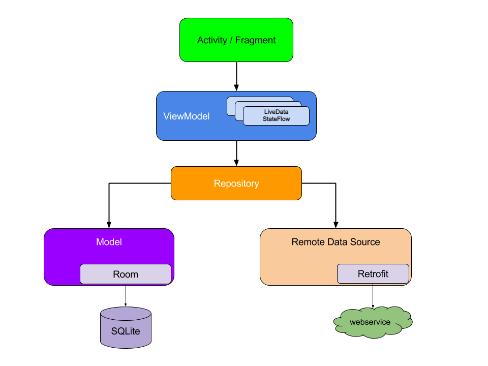
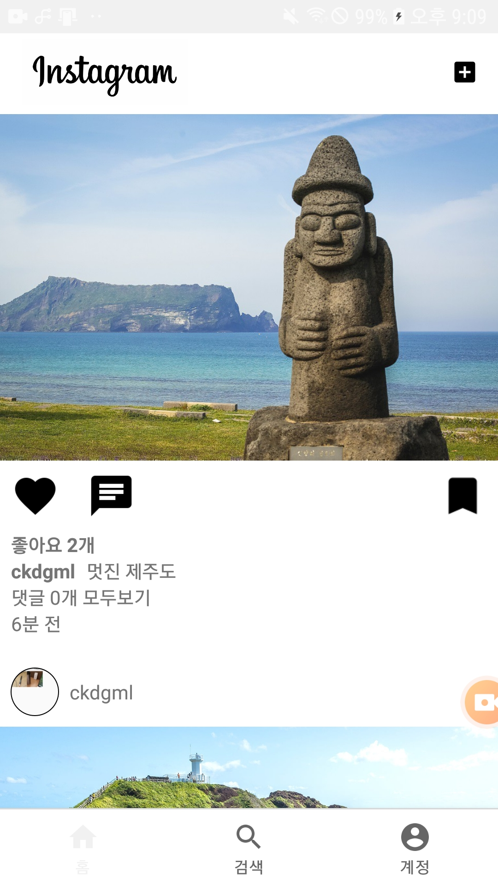
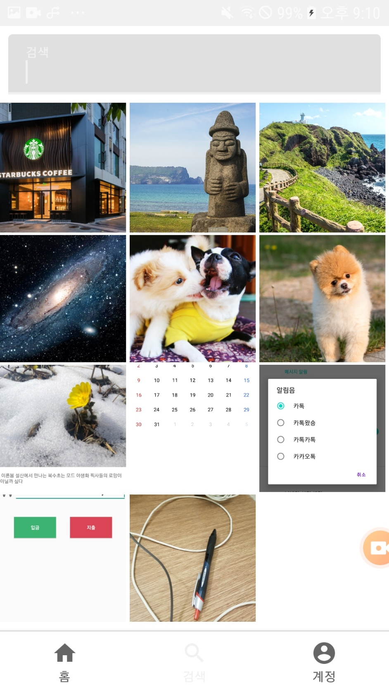
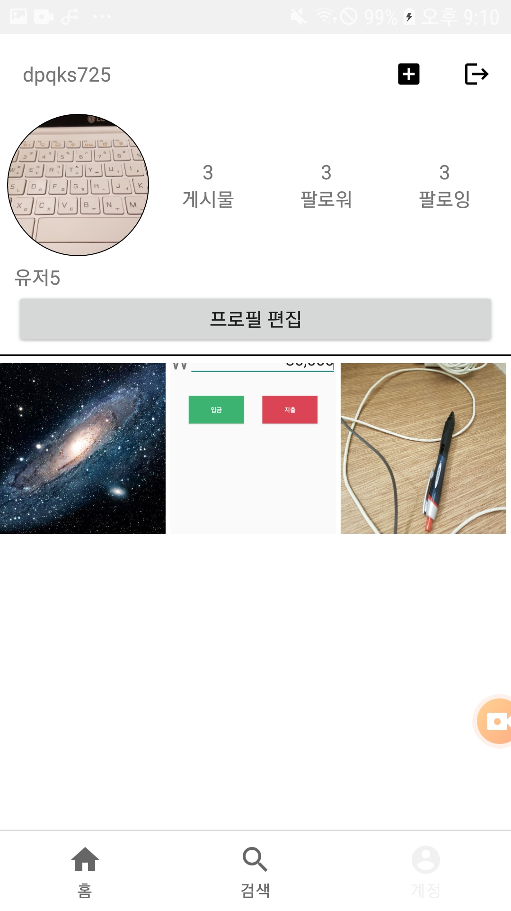
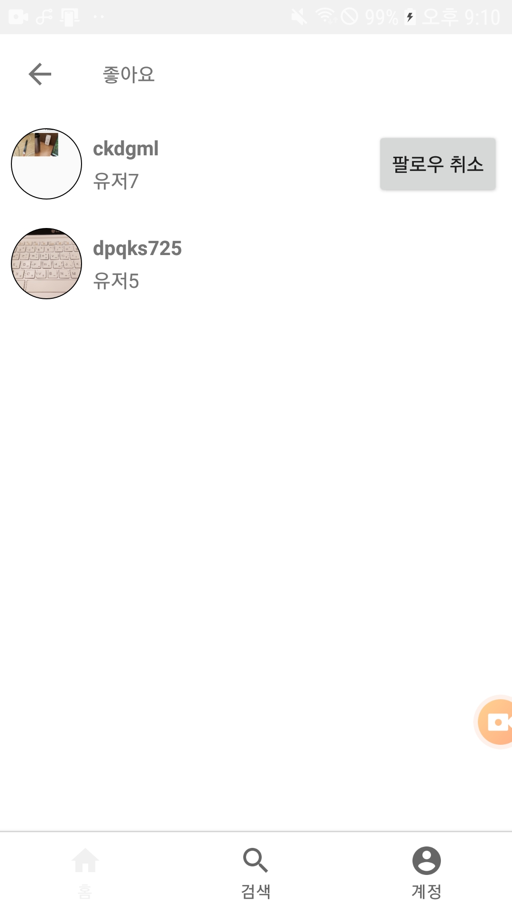
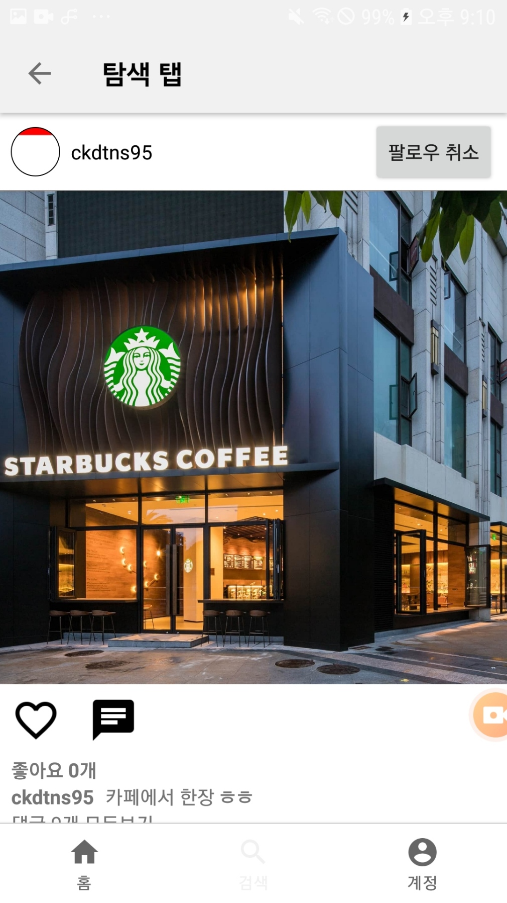
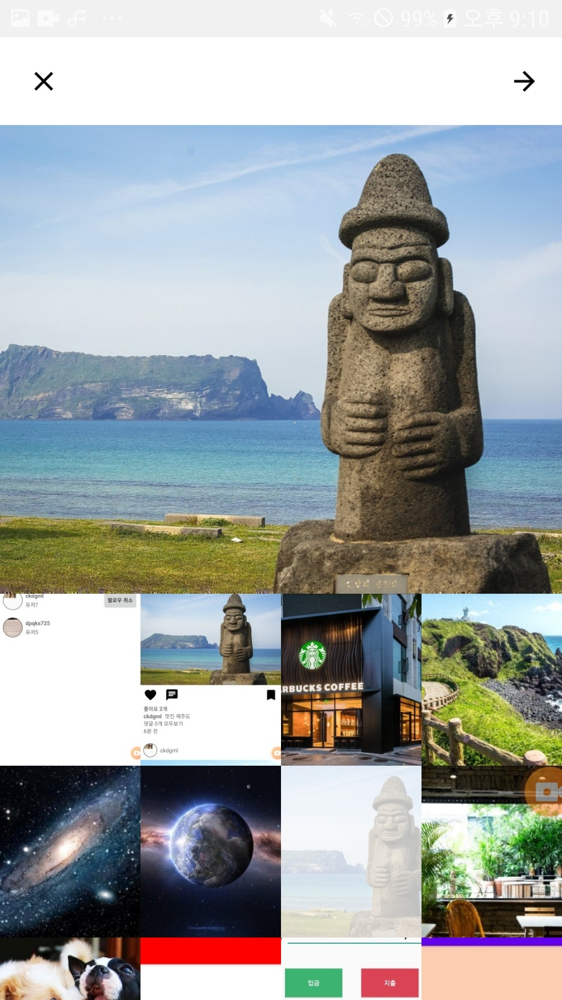

# 서비스 소개

인스타그램 앱을 클론한 앱으로 안드로이드 JetPack 라이브러리와 Google Firebase를 중심으로 사용해 구현했습니다. 백엔드 역할을 수행하는 Firebase와의 통신은 Coroutine + Flow를 통해 구현하였습니다. 앱의 아키텍쳐 구조는 MVVM 패턴을 사용하였고, 계속해서 인스타그램과 비슷하게 만들어가며 여러 다양한 라이브러리들을 적용시킬 계획입니다.

 

# Mad Scored

 

# 라이브러리

* [Android KTX](https://developer.android.com/kotlin/ktx)
* [LiveData](https://developer.android.com/topic/libraries/architecture/livedata)
* [Data Binding](https://developer.android.com/topic/libraries/data-binding/)
* [Lifecycles](https://developer.android.com/topic/libraries/architecture/lifecycle)
* [ViewModel](https://developer.android.com/topic/libraries/architecture/viewmodel)
* [Hilt](https://developer.android.com/training/dependency-injection/hilt-android)
* [CircleImageView](https://github.com/hdodenhof/CircleImageView)
* [Joda-Time](https://github.com/dlew/joda-time-android)
* [Coroutine and Flow](https://kotlinlang.org/docs/coroutines-overview.html)
* [Glide](https://bumptech.github.io/glide/)
* [Firebase](https://firebase.google.com/docs?authuser=0)
* [Navigation](https://developer.android.com/guide/navigation?gclid=CjwKCAjw5NqVBhAjEiwAeCa97VYS3en5uPPWLRuwP0C1XLXl-QIQmHjy3_PjdJz49VOTsFPiNRyB5xoCOMAQAvD_BwE&gclsrc=aw.ds)

 

# Architecture

MVVM 디자인 패턴 및 repository 패턴

 

# 앱 스크린샷

&ensp;

 

&ensp;

 